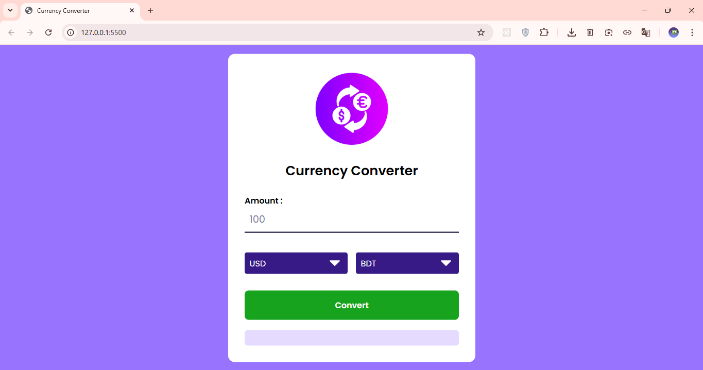

# 💱 Currency Converter

A simple and efficient **Currency Converter** application that allows users to convert between different currencies instantly with real-time exchange rates. This project is designed to be user-friendly and helps in quick financial calculations.

---
## 🚀 Demo

### 🌐 Live demo: [click here](https://digitalclock-shifat01.netlify.app/)

#### or, 

### link: https://digitalclock-shifat01.netlify.app

>
---

## 📸 Preview




---

## 🚀 Features

- **Real-time Conversion:** Get up-to-date currency exchange rates.
- **User-Friendly Interface:** Clean and simple UI for better user experience.
- **Multiple Currencies:** Supports major global currencies (USD, BDT, EUR, GBP, etc.).
- **Responsive Design:** Works smoothly on both desktop and mobile devices.

## 🛠️ Tech Stack

- **Frontend:** HTML5, CSS3
- **Scripting:** JavaScript (ES6+)
- **API:** currencyapi.com


## ⚙️ How to Run Locally

To run this project on your local machine, follow these steps:

## 💻 How to Run

1. Download or clone the repository:
   ```bash
   git clone 
2. Open the index.html file directly in your browser.
That’s it — your clock will start running instantly!


---

🧑‍💻 Author
Shifat

## 📝 License
- [MIT License](LICENSE)
